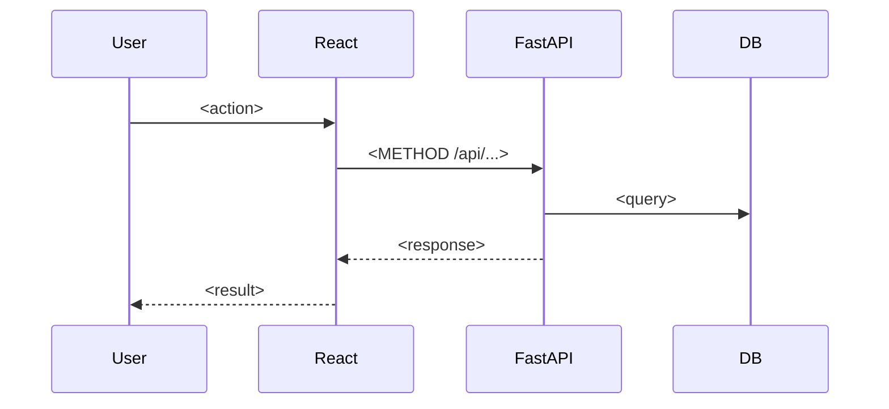

# Architecture — <Solution Name>

> **Contract version:** v1 · **Source:** docs/problem.md · **Status:** Proposed — pending team decision on §8 and §9
> Generated by the `solution-architect` agent. This is the only document `frontend-engineer` and `backend-engineer` share.

## 1. Critical User Journey

`<Entry> → <Main screen> → <Primary action> → <Processing> → <Result> → <Value shown>`

Covers: <FR-01, FR-02, AC-01, AC-03 ...>

## 2. Components & Boundaries

```
[React SPA (Vite)] --/api/*--> [FastAPI] --> [SQLAlchemy / DB]
                                    |
                                    +--> [<External API / LLM>] (mock mode: <ENV_VAR>=true)
```

| Component | Responsibility | Traces to |
|---|---|---|
| | | |

Boundary rule: the frontend depends only on §4; the backend knows nothing about screens.

## 3. Data Model

### <Entity>
| Field | Type | Required | Constraints / Notes |
|---|---|---|---|
| id | int | yes | PK |

Relationships: <...>

### Seed data (fresh-start demo)
| Entity | Records needed | Supplied by |
|---|---|---|
| | | Functional team |

## 4. API Contract

Base path `/api`. JSON keys snake_case. Timestamps ISO-8601 UTC. Lists return `{"items": [...], "total": n}`.
Error envelope (all non-422 errors): `{"detail": "<message>", "code": "<MACHINE_CODE>"}`. 422 uses FastAPI's default validation shape.

### Endpoint summary
| # | Method | Path | Purpose | Auth | Traces to |
|---|---|---|---|---|---|
| 0 | GET | /api/health | Connectivity check | no | — |

### `METHOD /api/<path>`
**Purpose:** <...> · **Auth:** <yes/no> · **Traces to:** <IDs>

Params: <none | name: type — description>

Request:
```json
{}
```
| Field | Type | Required | Constraints |
|---|---|---|---|

Response `200`:
```json
{}
```
| Field | Type | Notes |
|---|---|---|

Errors:
| Status | code | When |
|---|---|---|

### Shared types

```ts
// frontend/src/api/types.ts
export interface Example { id: number; created_at: string; }
```

| TypeScript interface | Pydantic schema (`app/schemas/`) |
|---|---|
| `Example` | `ExampleRead` |

## 5. Frontend Structure

| Route | Page | Journey step | Key components | API calls |
|---|---|---|---|---|
| / | | | | |

State: <local state + `src/api/` client>. Loading / empty / error handling: <per call on the critical path>.

## 6. Backend Structure

| Router (`app/routers/`) | Endpoints | crud | models | schemas |
|---|---|---|---|---|
| | | | | |

Business & validation rules:
| Rule | Enforced in | Traces to |
|---|---|---|

Migrations: <initial Alembic revision contents>. Seeding: <script / startup hook>.

## 7. Key Workflows



## 8. Scope Cut & Build Split — *proposal, team decides*

**Must have**
- [ ] <item> — <ID>

**If time permits** (highest value-per-hour first)
- [ ] <item> — <ID>

**First 30 minutes**
| Role | Starts with |
|---|---|
| Frontend engineer | Pages + `api/` client against mocked responses copied from §4 examples |
| Backend engineer | Models, migration, `/api/health`, then critical-path endpoints |
| Integration / QA | Vite proxy + CORS, seed data, contract check scripts |

## 9. Open Decisions — *team resolves, log in docs/decision-log.md*

| # | Decision | Options | Trade-off | Recommendation |
|---|---|---|---|---|

## 10. Technical Risks

| Risk | Likelihood | Demo impact | Mitigation |
|---|---|---|---|

## 11. Assumptions

- A1: <...>

## Contract Changelog

| Version | Change | Reason | Who must update |
|---|---|---|---|
| v1 | Initial contract | — | — |
